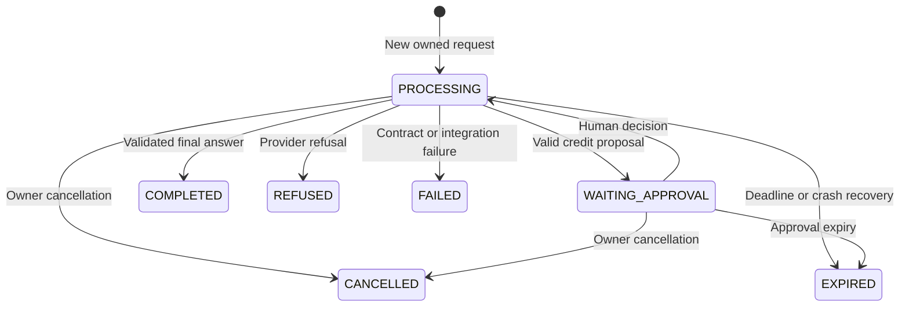

# Architecture and code walkthrough

## The business problem

An authenticated support operator asks about a service order. The application can retrieve that tenant's order and a fixed policy. If it proposes a service credit, it records a pending action and stops. A different authorized reviewer accepts or denies the exact action. Accepting writes to a local ledger; no payment processor is connected.

## Run state machine

An approval can pause the same run once. Steps and reserved budgets survive that pause; approval does not reset the token/step limits. The active execution deadline restarts when a human decision is committed. Waiting time is bounded separately by the approval TTL.

## Follow the code in this order

| Component | Responsibility |
| --- | --- |
| `AgentController` | Validated HTTP contracts and SSE delivery |
| `Actor`, `SecurityConfiguration` | Trusted tenant/subject and role/scope checks |
| `RunStore.begin` | Ownership, session serialization, idempotent creation |
| `ContextPolicy` | Stable instructions, media validation, whole-turn eviction |
| `BudgetPolicy` | Pre-call time, step, token and estimated-cost checks |
| `SpringAiModel` | Default Spring AI ChatClient integration, messages, strict output, streaming, usage and finish reasons |
| `OpenAiModel` | Optional direct Responses SDK integration, including encrypted reasoning items |
| `AgentServiceImpl` | Bounded loop, outcome dispatch, mandatory hook ordering |
| `ToolCatalog`, `ToolExecutor` | Exact field validation, tenant-scoped queries, structured errors |
| `RunStore.decide` | Four-eyes approval and atomic ledger commit |
| `OutputPolicy` | Final JSON and evidence/business checks |
| `PolicyServer`, `McpPolicyGateway` | Real stdio MCP server/client for the policy |

The model adapter is an interface boundary so deterministic tests can replace the provider. No part of the tool layer needs an OpenAI SDK type.

## Persistence and concurrency

`sessions` stores successful conversation history and an `active_run` pointer. `runs` stores durable checkpoints including full provider output items, observations, counters, and status. `approvals` stores immutable tool arguments and a decision. `service_credits` stores the business effect. `audit_events` records event metadata without prompt bodies.

`RunStore.begin` locks the owned session before inspecting its idempotency key or active run. Concurrent requests with the same key converge on one run. The same key with different input is a conflict. Different runs cannot execute concurrently within one session. A SQL unique constraint backs up the idempotency invariant.

Terminal and approval transitions acquire locks in session-then-run order. Checkpoint updates require a live `PROCESSING` row. A cancelled/expired worker cannot overwrite the terminal state or release a newer run's session pointer. There is no automatic replay after an execution crash: the recovery job expires the run and releases the session.

Approval processing locks and rechecks the order. It writes the credit, approval decision, resumed transcript, and audit event in one database transaction. The database enforces one credit per tenant/order and one credit per run. If the following model call fails, the credit remains committed and is shown independently in `RunView.credits`.

External effects would need an outbox/worker, a provider idempotency key, and reconciliation of uncertain outcomes. Adding an HTTP payment call inside the approval transaction would not create distributed atomicity.

## Prompt and context boundaries

Application policy is sent as a Spring AI `SystemMessage` on every request (`instructions` in the direct Responses adapter). User input never becomes that policy. Read results return as `function_call_output`, tied to the exact provider call ID. The deterministic workflow wraps its code-fetched data in XML markers with escaped delimiters. Markers improve separation; authorization comes from Java and database checks.

Only whole old user turns are evicted. Current-turn tool exchanges are retained intact or rejected for excess size. Images have a separate input-size limit, remote image URLs are disallowed, and selected history retains at most two image-bearing user messages. This implementation does not generate lossy summaries or claim exact tokenizer accounting.

Provider output items are round-tripped as structured items rather than flattened text. The direct Responses adapter requests encrypted reasoning content for provider-storage-disabled conversations. Spring AI translates stored user/assistant/tool exchanges into typed messages for Chat Completions. Start a new session when changing adapters; unsupported Responses-only items are rejected. It never exposes reasoning content through the response API. The application emits only final text deltas as provisional SSE fragments.

## Mandatory application hooks

These are ordinary Java control points, not Claude Code hook configuration:

| Point | Deterministic enforcement |
| --- | --- |
| Before accepting a run | Authentication, scope, tenant/owner, input bounds, idempotency, session exclusivity |
| Before each model call | Deadline, step limit, context limit, token/cost reservation, current-run fence |
| After provider completion | Terminal status and refusal checks; incomplete arguments never execute |
| Before a tool | Allowlisted name, exact JSON fields/types, business validation |
| Before a credit | Separate approver identity, immutable proposal, expiry, fresh order checks, database uniqueness |
| Before a final answer | JSON schema shape, allowed action, observed evidence, credit receipt state |

Structured validation limits specific failure modes. It cannot prove every sentence in `summary` is accurate or solve prompt injection universally. Use representative and adversarial live evaluations, minimize tool privileges, and choose a suitable display policy for unvalidated streaming text.

## Retry and streaming semantics

The SDK's automatic retries are disabled. The Spring AI adapter makes one attempt, requires both a finish reason and token usage, and retains the reserved budget if either is missing. The direct Responses adapter allows at most two attempts and only retries selected transient HTTP/network failures before receiving any stream event. It honors a usable `Retry-After`; if that wait exceeds the short retry/run budget, it fails instead of retrying early. A broken or incomplete stream is not replayed.

Spring AI 2 automatically adds a tool-calling advisor by default. This application disables that registration with `ChatClientAttributes.TOOL_CALLING_ADVISOR_AUTO_REGISTER=false`. Its schema callbacks also throw if accidentally invoked. Only `AgentServiceImpl` executes validated tools or pauses for approval.

Tool arguments are consumed only from a complete terminal provider response. `delta` events cannot cause a business action. Closing an SSE consumer is detected on callbacks/writes; the worker checks cancellation between operations. An in-flight provider request can take up to its timeout to unwind. A failed provider attempt may still have consumed tokens, which is why reservations remain conservative.

The configured concurrency semaphore and stream thread pool are process-local. They bound one application instance. Multi-instance request-rate and tenant spend enforcement belongs at ingress or in a shared quota service; it is not supplied by this semaphore.

## MCP boundary

The host starts a known Java executable and packaged server jar with fixed arguments. It passes only a small environment allowlist and does not expose a shell interface to the model. The MCP server returns the fixed synthetic policy through a tool and a resource; tenant-sensitive database access stays in the host application.

The server process has the operating-system permissions of its container/user. Clearing environment variables reduces secret exposure but is not an OS sandbox. Use a separate restricted container/identity when connecting untrusted MCP implementations. Do not treat server tool annotations as authorization grants.

## Deliberate choices

- A modular monolith keeps the control flow readable; microservices would add deployment and distributed-state complexity without helping these lessons.
- JDBC makes locks, conditional updates, and database invariants visible. JPA can be used later with equivalent locking/transaction behavior.
- No Redis is required. The database holds correctness-critical state; a future cache must not become the approval authority.
- No Kafka is required for a local ledger. A future external action is a suitable outbox/event exercise.
- No vector search is claimed. The small fixed policy is retrieved by a tool. RAG is a separate learning extension.

Implementation references: [OpenAI function calling](https://developers.openai.com/api/docs/guides/function-calling), [OpenAI streaming](https://developers.openai.com/api/docs/guides/streaming-responses), and [MCP Java SDK](https://java.sdk.modelcontextprotocol.io/latest/).

## Spring MVC packages and service boundaries

| Package | Responsibility | Examples |
| --- | --- | --- |
| `controller` | HTTP routing, request validation, authenticated identity, SSE transport | `AgentController`, `SessionController` |
| `dto.request` | Typed API inputs with Jakarta Bean Validation | `RunRequest`, `DecisionRequest` |
| `dto.response` | Typed API outputs with stable JSON field names | `RunResponse`, `SessionResponse`, `AnswerResponse` |
| `dto` | Shared API enum | `RunMode` |
| `service` | Application use-case interfaces | `AgentService`, `SessionService` |
| `service.impl` | Workflow execution and session lifecycle implementations | `AgentServiceImpl`, `SessionServiceImpl` |
| `service.event` | Internal event envelope used by the streaming adapter | `AgentEvent` |
| `repository` | JDBC persistence and atomic state transitions | `RunStore` |
| `exception` | Application failures and centralized HTTP problem responses | `ApiException`, `GlobalExceptionHandler` |
| `engine` | Model adapters, context, budgets, structured-output policies | `SpringAiModel`, `ModelPort`, `OutputPolicy` |

Controllers use constructor-injected service interfaces and never access `RunStore` directly. `POST /api/sessions` routes through `SessionController` → `SessionService` → `SessionServiceImpl` → `RunStore`, returning `SessionResponse`. Run, get, decision, and cancellation requests go through `AgentService` and `AgentServiceImpl`. SSE lifecycle and servlet details stay in the controller; the service emits transport-independent `AgentEvent` objects.

Each request and response is a separate Java record. Their names and packages changed, but endpoint URLs, JSON property names, enum values, validation constraints, and status codes are preserved. The prior nested `Contracts` container is removed. These source-level class moves require updating imports for Java consumers.

JDBC transactions remain scoped to atomic persistence operations in `RunStore`; the whole model execution loop is not wrapped in a database transaction. This avoids holding locks while waiting for external model calls or human approval. DTO projection assembly remains in the JDBC store for this application; there is no JPA entity layer.

Interfaces provide an explicit service boundary here. This package organization is a project convention, not a requirement imposed by Spring MVC.
