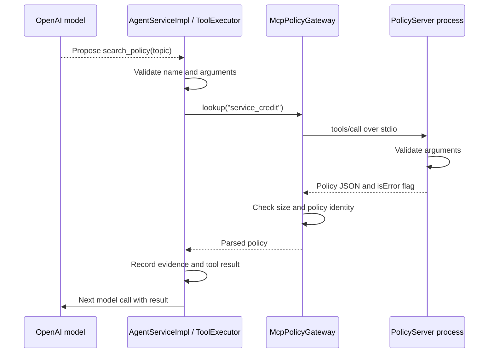

# MCP in this project: client, server, and a complete request

MCP is a protocol for applications to discover and use external tools and context. Here, the external capability is a synthetic automotive service-credit policy. Both the client and server are Java code.

## The three roles

| Role | Code | Job |
| --- | --- | --- |
| Host | Spring Boot application, `AgentServiceImpl`, `ToolExecutor` | Talks to the model and enforces identity, budgets, tool validation, and approvals |
| MCP client | `infrastructure/mcp/McpPolicyGateway.java` | Starts the server, initializes the connection, discovers its tool, calls it, and reads its resource |
| MCP server | `infrastructure/mcp/PolicyServer.java` | Advertises and serves the fixed policy through the MCP Java SDK |

The host contains the client. The server runs in a **separate operating-system process**. They use the same packaged JAR in two different execution modes.

## How the server starts

Normal mode runs `SpringApplication.run(...)` from `Application.java`. When the argument is exactly `--mcp-stdio`, `Application.main` calls `PolicyServer.serve()` instead. That mode does not start the web application or connect to its database.

When MCP is enabled, `RuntimeConfiguration` creates `McpPolicyGateway`. Its constructor builds this process command:

```text
java -jar <configured-server-jar> --mcp-stdio
```

`StdioClientTransport` launches the process. Standard input and standard output carry JSON-RPC protocol messages; no HTTP endpoint or extra server port is involved. Application logs go to standard error so they cannot corrupt protocol messages on standard output.

The client calls `initialize()` and then `listTools()`. Initialization negotiates the protocol and capabilities. Discovery checks that the server exposes exactly the allowed tool, `search_policy`. This happens once when the bean starts; subsequent lookups reuse the client. Closing the bean closes the MCP connection gracefully.

## What the server exposes

`PolicyServer` registers two capabilities with `McpServer.sync(transport)`:

| Capability | Identifier | How to use it |
| --- | --- | --- |
| Tool | `search_policy` | Call it with `{"topic":"service_credit"}` |
| Resource | `policy://service-credit/v1` | Read this URI to retrieve the policy as JSON |

A **tool** is an operation with named arguments. A **resource** is addressable content. Both return the same fixed policy here, which includes the INR 500 limit, delayed-order eligibility, and the requirement for a different human approver.

The resource URI is an MCP identifier, not an HTTP address. The agent flow uses the tool; `readPolicyResource()` and the integration test demonstrate resource access separately.

## Follow a model-requested policy lookup



The model proposes a tool call. **Java decides whether and how to execute it.** The model does not open the MCP connection itself.

`ToolExecutor.executeRead()` first uses `ToolCatalog.validate()` to reject unknown names, missing/extra fields, and invalid types. For `search_policy`, it delegates to `PolicyGateway.lookup()`.

The MCP client sends a `CallToolRequest`. The server validates the arguments again and returns `CallToolResult` with text JSON, structured content, and `isError=false`. Invalid arguments produce `isError=true` with structured feedback.

The client rejects MCP errors, results longer than 8,000 characters, and an unexpected `evidenceId`. `ToolExecutor.appendResult()` then records the policy evidence and adds a tool result tied to the original model call ID. On its next iteration, the model can use those facts in its answer. MCP errors and application tool-error categories are separate layers.

## What remains outside MCP

- `lookup_order` queries the application's database with a trusted tenant filter.
- `propose_credit` can only create a pending approval through the application.
- The authenticated reviewer calls the application's decision API; `RunStore.decide()` records the credit transactionally.
- The MCP server receives no OpenAI key, database password, or identity-provider credentials. The host only passes a small process environment allowlist.
- The model sees the host's explicit `ToolCatalog`. Discovery does not automatically grant access to every tool an arbitrary server might advertise.

This server is a small read-only policy provider. It is not a generic SQL server, a filesystem server, a vector database, or a RAG implementation. Clearing its environment reduces secret exposure; operating-system isolation still depends on its deployment/container identity.

## Run it yourself

From the project directory:

```bash
./mvnw package
java -jar target/agent-foundations-1.0.0.jar --spring.profiles.active=local --agent.mcp.enabled=true
```

In PowerShell, use `.\mvnw.cmd package` for the first command. The second command is the same. The host starts the child server automatically; you do not need to launch it in another terminal.

The local profile uses `STUB`, so this demonstrates a real MCP connection without a paid model call. `--agent.mcp.enabled=false` selects the in-process policy implementation instead. The same `PolicyGateway` interface lets the rest of the application use either implementation.

`./mvnw verify` includes `McpProcessIT`: it launches the actual packaged Java server, initializes and discovers it, calls the policy tool, reads the resource, and closes the connection. No mocked MCP server is used in that test.

This implementation uses the MCP Java SDK directly. Its client/server classes are not Spring AI MCP starter auto-configuration. Spring AI handles the model integration elsewhere in the application.
